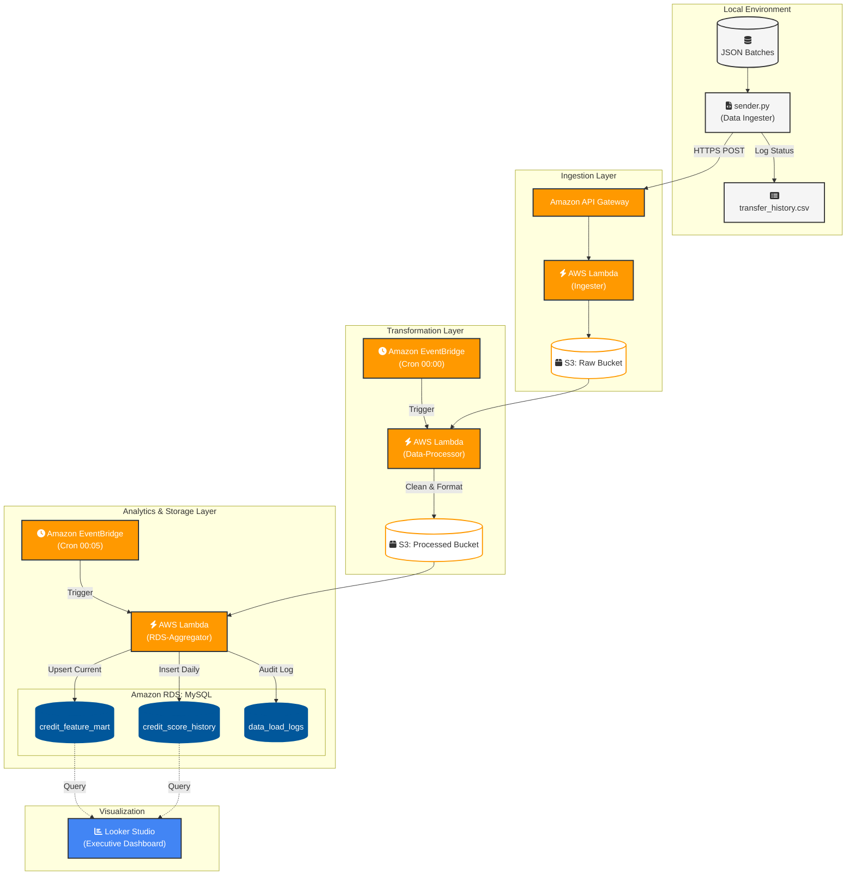

เพื่อให้รายงานฉบับนี้สมบูรณ์แบบที่สุดสำหรับระดับ **MSDS** ผมได้ปรับปรุงเนื้อหาให้มีความเป็นวิชาการ (Academic Tone) ผสมผสานกับแนวคิดเชิงธุรกิจ (Business Value) พร้อมทั้งจัดโครงสร้างให้สวยงามและอ่านง่ายครับ

---

# 📑 รายงานโครงการฉบับสมบูรณ์: ระบบวิศวกรรมข้อมูลเพื่อการวิเคราะห์คะแนนเครดิตเชิงพฤติกรรมบนสถาปัตยกรรมคลาวด์แบบ Serverless
**Project Title:** End-to-End Automated Cloud-Based Credit Behavioral Scoring Pipeline

---

## 1. บทนำและที่มาของโครงการ (Project Overview & Rationale)
ในยุค Digital Transformation สถาบันการเงินจำเป็นต้องปรับตัวจากการใช้เพียงข้อมูลแบบดั้งเดิม (Static Data) มาเป็นการวิเคราะห์ **Alternative Data** เพื่อให้เข้าถึงพฤติกรรมผู้บริโภคที่แท้จริง โครงการนี้จึงถูกออกแบบมาเพื่อสร้างระบบ **Automated Data Pipeline** ที่ทำหน้าที่รวบรวม ประมวลผล และวิเคราะห์ข้อมูลธุรกรรมรายวัน (Transaction Data) เพื่อคำนวณคะแนน **Credit Behavioral Score** แบบอัตโนมัติ โดยมุ่งเน้นที่ความถูกต้องของข้อมูล (Data Integrity) และความสามารถในการขยายตัวของระบบ (Scalability)

## 2. การวิเคราะห์ปัญหาและแนวทางการแก้ไข (Problem Analysis & Solutions)

| ปัญหาที่พบ (Challenges) | แนวทางการแก้ไข (Engineering Solutions) |
| :--- | :--- |
| **Data Quality:** รูปแบบวันที่ไม่สอดคล้องและมีข้อมูลซ้ำซ้อน | ใช้ **Pandas** ภายใน Lambda เพื่อทำ Data Standardization และ Deduplication |
| **Scoring Skewness:** คะแนนเกาะกลุ่มสูงเกินไป ไม่สามารถแยกแยะกลุ่มเสี่ยงได้ | พัฒนา **Multi-factor Scoring Logic** โดยใช้ตัวหาร (Denominator) ที่สะท้อนความเป็นจริง |
| **System Automation:** การรันงานด้วยมือมีความเสี่ยงต่อความผิดพลาด | ใช้ **AWS EventBridge** เป็น Scheduler ควบคุมจังหวะเวลาการทำ ETL |
| **Observability:** ขาดการติดตามประวัติการนำเข้าข้อมูล | ออกแบบระบบ **Dual-Logging** ทั้งบนเครื่อง Local (CSV) และบน Cloud (RDS Log) |

## 3. สถาปัตยกรรมทางเทคนิค (Technical Architecture)

## 4. รายละเอียดการประมวลผลข้อมูล (Data Pipeline Logic)

### 4.1 Data Cleaning & Pre-processing
ในขั้นตอน **Data-Processor** ระบบจะทำการ Transform ข้อมูลดิบให้เป็นโครงสร้างที่พร้อมสำหรับ Analytics (Silver Layer) ดังนี้:
* **Timestamp Normalization:** แปลงวันที่จากรูปแบบคละกัน (เช่น DD/MM/YYYY หรือ ISO) ให้เป็นมาตรฐาน `YYYY-MM-DD HH:MM:SS`
* **Deduplication:** กำจัดข้อมูลซ้ำซ้อนด้วย `txn_id` เพื่อป้องกันการคำนวณยอดเงินเกินจริง (Overcounting)
* **Currency Conversion:** ตรวจสอบคอลัมน์ `curr` และแปลงยอดเงินจาก USD/JPY ให้เป็น THB ตามอัตราแลกเปลี่ยนปัจจุบัน

### 4.2 Feature Engineering: Behavioral Scoring Model
หัวใจของระบบคือการคำนวณคะแนนโดยใช้ปัจจัยถ่วงน้ำหนัก (Weighted Scoring) ดังนี้:
1.  **Financial Stability (40%):** วัดจาก `total_spent_thb` (Max Score ที่ 500,000 THB)
2.  **Lifestyle Diversity (30%):** วัดจาก `distinct_categories` (Max Score ที่ 10 หมวดหมู่)
3.  **Financial Consistency (20%):** วัดจาก `txn_count` (Max Score ที่ 150 รายการ)
4.  **Purchasing Power (10%):** วัดจาก `avg_ticket_size` (เปรียบเทียบกับกลุ่มตัวอย่าง)

นอกจากนี้ยังมีการคำนวณ **Essential Spending Ratio** เพื่อแยกแยะสัดส่วนค่าใช้จ่ายจำเป็น ซึ่งเป็นตัวชี้วัดสำคัญของ "ความสามารถในการชำระหนี้" (Debt Serviceability)

## 5. การออกแบบฐานข้อมูล (Relational Database Schema)
เราเลือกใช้ **Amazon RDS (MySQL)** เพื่อรองรับการทำ ACID Transactions โดยแบ่งตารางดังนี้:
* **`credit_feature_mart`:** ตารางหลักที่เก็บสถานะปัจจุบันของลูกค้า (Current Profile)
* **`credit_score_history`:** ตารางเก็บประวัติ (Historical Data) เพื่อใช้ทำ Time-series Analysis ใน Looker Studio
* **`data_load_logs`:** ตาราง Audit เพื่อตรวจสอบ Row Count ของข้อมูลที่ไหลเข้าระบบในแต่ละไฟล์

## 6. ผลลัพธ์และสรุปโครงการ (Results & Conclusion)
* **High Efficiency:** ระบบทำงานแบบ Serverless 100% ทำให้ไม่มีค่าใช้จ่ายในขณะที่ไม่มีข้อมูลไหลเข้า และขยายตัวได้ทันทีเมื่อมีข้อมูลปริมาณมาก
* **Insightful Visualization:** Looker Studio แสดงผลการกระจายตัวของคะแนนแบบ **Normal Distribution** ช่วยให้ฝ่ายวิเคราะห์ความเสี่ยงสามารถคัดกรองลูกค้า (Segmentation) ได้อย่างแม่นยำ
* **Standardized Process:** โครงการนี้ได้สร้างมาตรฐานการจัดการข้อมูลตั้งแต่ต้นน้ำถึงปลายน้ำ ซึ่งสามารถนำไปต่อยอดใช้กับโมเดล Machine Learning ในอนาคตได้ทันที

---
**นำเสนอโดย:** นรวิชญ์ ธราภูมิพิพัฒน์ (Narawit Tharapoompipat)
**หลักสูตร:** Master of Science in Data Science (MSDS)
**หัวข้อโครงการ:** วิศวกรรมข้อมูลและวิเคราะห์คะแนนเครดิต (Data Engineering & Credit Analytics)
---

### 💡 คำแนะนำเพิ่มเติมสำหรับการ Present:
* **ตอนพูดถึง Mermaid Diagram:** ให้เน้นว่าระบบเป็น **"Event-Driven"** คือทำงานเมื่อมีข้อมูลใหม่เข้ามาเท่านั้น
* **ตอนพูดถึง Scoring:** อธิบายว่าเราใช้ความรู้ด้าน **Domain Expertise** ในการกำหนด Weights (เช่น ทำไมถึงให้ความสำคัญกับยอดรวม 40%)
* **ตอนสรุป:** พูดถึงแนวโน้มการนำไปทำ **Predictive Modeling** เพื่อโชว์วิสัยทัศน์ในฐานะนักศึกษา Data Science ครับ

**ขอให้การ Present ราบรื่นและได้เกรด A นะครับ!**
